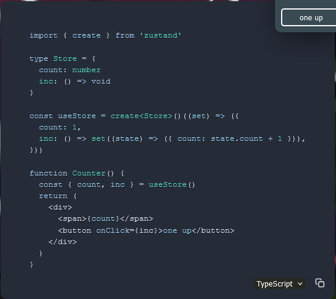
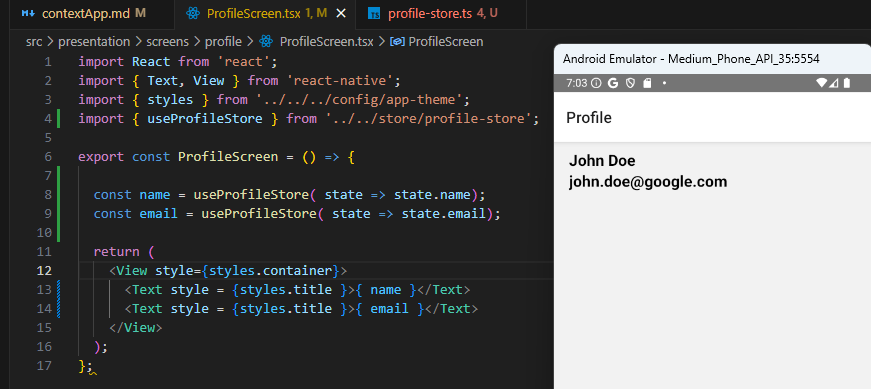
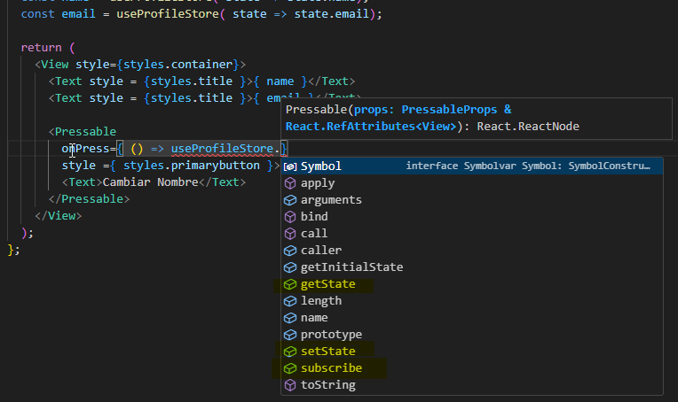
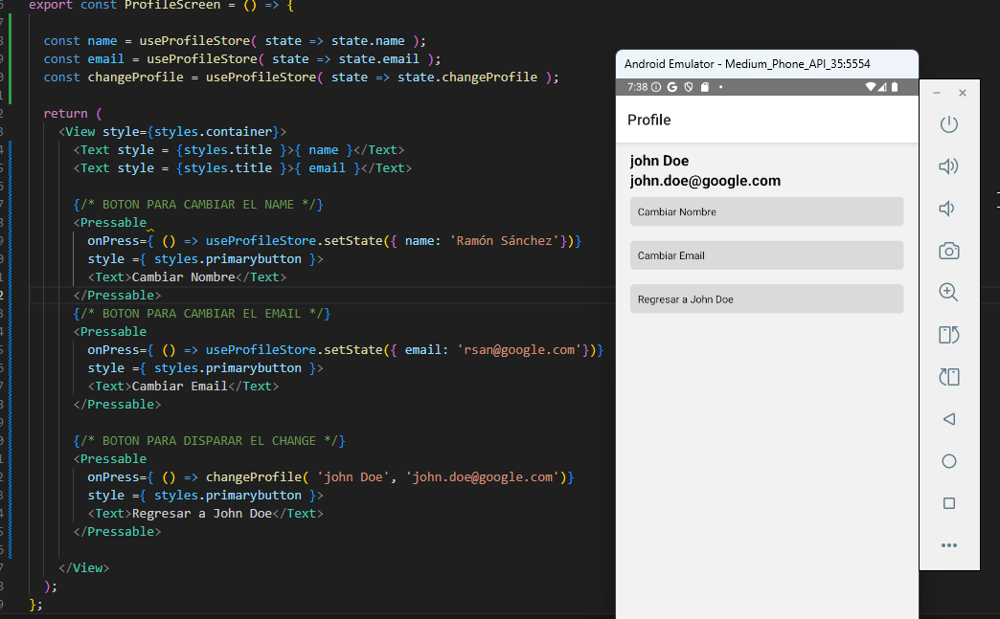
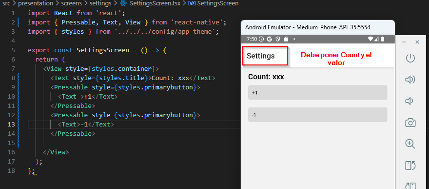
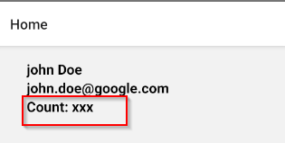
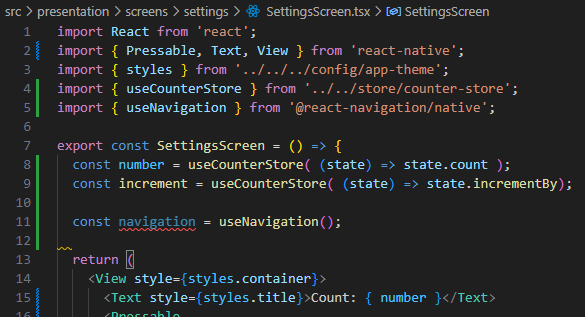
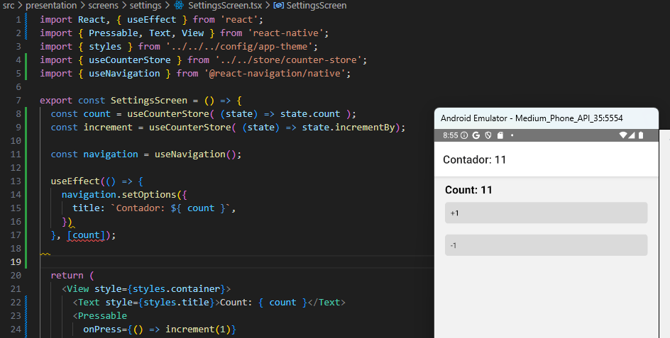

71. Inicio del proyecto Context App
72. Preparación de la aplicación y tarea
73. Zustand - Gestor de Estado
74. Cambios en el Store
75. Tarea- CounterStore


### 71. Inicio del proyecto Context App
1. Navegamos a la carpeta de react-native con cmd: **```C:\Users\rsanchez\Desktop\React_Native>```**
2. Ejecutamos: **```npx @react-native-community/cli init contextApp --version 0.76.1```**
3. Renombramos la carpeta creada a 05-ContextApp
4. Trabajaremos con [Zustand](https://zustand.docs.pmnd.rs/getting-started/introduction) que es un gestor de estados.
5. Corremos Android y el emulador
6. Hacemos: ```npx react native start``` para arrancar el proyecto
7. Si me da error entro en la carpeta Android del proyecto y ejecuto : cd **```gradlew cleany```** luego intento ejecutar de nuevo el proyecto bajando de nivel la carpeta para situarnos en el proyecto y no en la carpeta del android

### 72. Preparación de la aplicación y tarea

1. Creamos la carpeta **src/**  dentro del root principal y dentro de **src/** creamos un componente que se llama **Main.tsx**

2. Borramos el **App.tsx** que hay en el root principal y en el **index.js** cambiamos el **App** por el **Main**
>Es posible que haya que tirar el servidor y volverlo a levantar

3. Creamos la estructura de directorios:
```bash
root/
├── src/
│   ├── App.tsx
│   ├── config/
│   │   └── app-theme.ts
│   └── presentation/
│       └── screens/
│             ├── home
│             │      └── HomeScreen.tsx
│             ├── profile 
│             │      └── ProfileScreen.tsx    
│             ├── settings 
│             │      └── SettingsScreen.tsx    
│             ├── navigators

```

4. En el **app-theme.ts** creamos lo siguiente:
```ts
import { StyleSheet } from "react-native";

export const styles = StyleSheet.create({
    container:{
        paddingHorizontal:20,
        marginTop:10,

    },
    title: {
        fontSize: 20,
        fontWeight: 'bold',
        color: '#000',
    },
    primarybutton:{
        backgroundColor: '#dadada',
        padding:10,
        borderRadius:5,
        marginVertical:10,
    },
});
```
5. Pongamosle estilo en el **HomeScreen.tsx**:
```ts
import React from 'react';
import { Text, View } from 'react-native';
import { styles } from '../../../config/app-theme';

export const HomeScreen = () => {
  return (
    <View style={ styles.container }>
      <Text style={ styles.title }>HomeScreen</Text>
    </View>
  );
};
```
6. Aplicamos los mismos estilos a **ProfileScreen.tsx** y en **SettingsScreen.tsx**

7. Vamos a crearnos el Bottom Tab Navigator para acceder a las pantallas home, profile, settins

## Navegación

- instalamos: **```npm install @react-navigation/native**```**
- instalamos: **```npm install @react-navigation/native```**
- instalamos: **```npm install react-native-screens react-native-safe-area-context```**
- instalamos: **```npm install @react-navigation/bottom-tabs```**
- Abrimos el archivo: **MainActivity.kt** y pegamos:
  ```import android.os.Bundle;``` y:
  ``` override fun onCreate(savedInstanceState: Bundle?) {
    super.onCreate(null)
  }
  ```dentro de ReactActivity(){}
- Tiramos y arrancamos de nuevo el servidor

- Vamos a instalar los iconos:


### 73. Zustand - Gestor de Estado

[Aquí](https://zustand-demo.pmnd.rs/) Podemos ver un ejemplo de un gestor de estado en Zustand


Si vemos la versión para typeScript es simplemente lo mismo pero añadiendo el tipo y una serie de sitaxis que se ve extraña pero es la necesita:




#### **Comenzamos instalando:**
**```npm install zustand```**

#### **Construcción del store**
Creamos un nuevo directorio dentro de **presentation/** que se llamará **store/**. Dentro nos creamos un archivo al que llamaremos **profile-store.ts**.
En este arhivo, lo primero que hacemos es crearnos el estado
```ts
export interface ProfileState{
    
}
```
Este será nuestro estado global para el perfil, y podemos tener x cantidad de stores. Por lo pronto solo quiero almacenar en mi state el **name** y el **email**.
```ts
export interface ProfileState{
    name: string;
    email:string;
}
```
Ahora creamos el store:
```ts
export const useProfileStore = create<ProfileState>()( )
```
En el último paréntesis recibe un callback:
```ts
export const useProfileStore = create<ProfileState>()( (set) =>({
    
}) )
```
>Podríamos crear un snippet para crear el store automáticamente

Necesitamos crear el **name** y el **email**:
```ts
export const useProfileStore = create<ProfileState>()( (set) =>({
    name: 'John Doe',
    email: 'john.doe@google.com',
}) );
```
Este **set** es el que yo tengo que mandar a llamar para cambiar los valores de name y email, pero también podemos tener la función **get** para poder obtener la información tal y como se encuentre en el store
```ts
export const useProfileStore = create<ProfileState>()( (set,get) =>({
    name: 'John Doe',
    email: 'john.doe@google.com',
}) );
```
#### **Leer los valores del store en nuestro componente**

Abrimos el **ProfileScreen.tsx**. En vez de mostrar el Texto de **ProfileScreen** quiero mostrar el **name** y el **email** del **store**.

Nos traemos el **useProfileStore** como un **hook**
```ts
 const name = useProfileStore( state => state.name);
```
Del state tomamos el **state.name** y lo guardamos en la constante **name** y lo mismo hacemos con el **email**
Y por último los usamos en nuestro **Text**:



Nos copiamos y pegamos  este código y abrimos el **HomeScreen.tsx**:

```ts
import React from 'react';
import { Text, View } from 'react-native';
import { styles } from '../../../config/app-theme';
import { useProfileStore } from '../../store/profile-store';

export const HomeScreen = () => {
    const name = useProfileStore( state => state.name);
    const email = useProfileStore( state => state.email);
  return (
    <View style={ styles.container }>
        <View style={styles.container}>
            <Text style = {styles.title }>{ name }</Text>
            <Text style = {styles.title }>{ email }</Text>
          </View>
    </View>
  );
};
```

Ya tenemos la misma información en la HomeScreen y el ProfileScreen

### 74. Cambios en el Store

Hay varias maneras de cambiar nuestro store. Dende el propio store o desde fuera. 

#### **CAMBIAR ESTADO DESDE FUERA DEL STORE**
Abramos el **ProfileScreen.tsx** y agreguemos un botón
```ts
 <Pressable style ={ styles.primarybutton }>
        <Text>Cambiar Nombre</Text>
      </Pressable>
```
Cuando yo hago press en ese botón quiero disparar algo, si llamamos a nuestro **useProfileStore.** podemos ver la cantidad de cosas que podmeos hacer:
Por ejemplo, el **subscribe** es como suscribirse a los cambios que se produzcan en el **state**.



También tenemos el **setState** y el **getState**, que establecen y obtienen el estado respectivamente.
Como vamos a cambiar el estado vamos a llamar al **setState()**

```ts
   onPress={ () => useProfileStore.setState({ name: 'Ramón Sánchez'})}
```
al pulsar el botón el name cambiará, y si me voy al Home veremos que también ha cambiado el nombre.
Dupliquemos el botón para cambiar ahora el email.
```ts
import React from 'react';
import { Pressable, Text, View } from 'react-native';
import { styles } from '../../../config/app-theme';
import { useProfileStore } from '../../store/profile-store';

export const ProfileScreen = () => {

  const name = useProfileStore( state => state.name);
  const email = useProfileStore( state => state.email);

  return (
    <View style={styles.container}>
      <Text style = {styles.title }>{ name }</Text>
      <Text style = {styles.title }>{ email }</Text>

      <Pressable 
        onPress={ () => useProfileStore.setState({ name: 'Ramón Sánchez'})}
        style ={ styles.primarybutton }>
        <Text>Cambiar Nombre</Text>
      </Pressable>
      <Pressable
        onPress={ () => useProfileStore.setState({ email: 'rsan@google.com'})}
        style ={ styles.primarybutton }>
        <Text>Cambiar Email</Text>
      </Pressable>
    </View>
  );
};
```

#### **CAMBIAR ESTADO DESDE DENTRO DEL STORE**
Si vamos al **profile-store.ts** es posible que queramos crear las modificaciones desde ahí. Normalmente querremos que las acciones de cambiar los estados se encuentren en el store y que no se vayan cambiando por todos los sitios de la aplicación.

Nos creamos una función que se llame **changeProfile** que va a recibir el **name** de tipo **string**, y un **email** de tipo **string** y eso no va a regresar nada.
```ts
export interface ProfileState{
    name: string;
    email:string;

    changeProfile: ( name:string, email:string ) => void;
}
```
Esa función de changeProfile va a cambiar ambos de manera simultanea. Dentro del **useProfileStore()** definimos nuestra función:

```ts
import { create } from "zustand";


export interface ProfileState{
    name: string;
    email:string;

    changeProfile: ( name:string, email:string ) => void;
}

export const useProfileStore = create<ProfileState>()( (set, get) =>({
    name: 'John Doe',
    email: 'john.doe@google.com',

    changeProfile: ( name:string, email: string) => {
        console.log(get());//devuelve el estado actual
        set( { name, email });//cambia el estado del name y el email set({ name:name, email:email })
    },

}) );
```

En el archivo de **ProfileScreen.tsx** donde para acceder a esa función la vamos a tomar así:
```ts
const changeProfile = useProfileStore( state => state.changeProfile );
```
Y creamos otro botón que nos devolverá el estado inicial de John Doe:
```ts
{/* BOTON PARA DISPARAR EL CHANGE */}
      <Pressable
        onPress={ () => changeProfile( 'john Doe', 'john.doe@google.com')}
        style ={ styles.primarybutton }>
        <Text>Regresar a John Doe</Text>
      </Pressable>
```



### 75. Tarea- CounterStore

Vamos a crear un nuevo store, que será un contador en la pantalla de Settings, y en vez de qu ela pantalla se llame Settings se va a llamar Counter y en el título de la pantalla el valor del counter.

Creamos un nuevo archivo dentro de **store/** que se llamará **counter-store.ts**. Vamos a definir la interfaz dentro de este store
```ts
export interface  CounterState {
   count: number;
   incrementBy: (value:number) => void;

}
```
Al store le llamaremos **useCounterStore**

La idea es que en el Settings tengamos dos botones, uno para incrementar y otro para decrementar.



También vamos a colocar en el HomeScreen el valor del count:




#### Solución de la tarea:

El archivo counter-store.tsx quedaría de la siguiente manera:
```ts
import { create } from "zustand";

export interface  CounterState {
   count: number;
   incrementBy: (value:number) => void;

}

export const useCounterStore = create<CounterState>()( (set, get) =>({
    count: 0,
    incrementBy: (value) => {
        //set( (state) => ({ count: state.count + value})); con el set también es válida
        set({ count:get().count + value });
    },
}));
```

Este sería el archivo settingsScreen.tsx:
```ts
import React from 'react';
import { Pressable, Text, View } from 'react-native';
import { styles } from '../../../config/app-theme';
import { useCounterStore } from '../../store/counter-store';

export const SettingsScreen = () => {
  const number = useCounterStore( (state) => state.count );
  const increment = useCounterStore( (state) => state.incrementBy);
  
  return (
    <View style={styles.container}>
      <Text style={styles.title}>Count: { number }</Text>
      <Pressable
        onPress={() => increment(1)}
      style={styles.primarybutton}>
        <Text >+1</Text>
      </Pressable>
      <Pressable 
      onPress={() => increment(-1)}
      style={styles.primarybutton}>
        <Text>-1</Text>
      </Pressable>

    </View>
  );
};
```
Para poner el valor del contador en el título de settings voy a usar el **useNavigation** dentro de **SettingsScreen.tsx**



Y luego usaremos un **useEffect()** con el **count** como dependencias.



