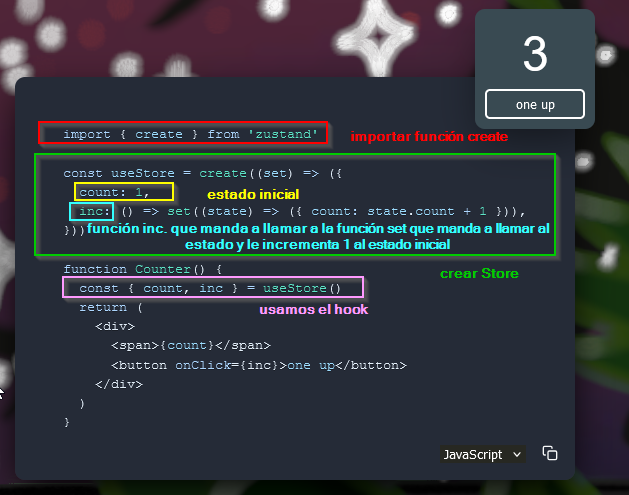

### 71. Inicio del proyecto Context App
1. Navegamos a la carpeta de react-native con cmd: **```C:\Users\rsanchez\Desktop\React_Native>```**
2. Ejecutamos: **```npx @react-native-community/cli init contextApp --version 0.76.1```**
3. Renombramos la carpeta creada a 05-ContextApp
4. Trabajaremos con [Zustand](https://zustand.docs.pmnd.rs/getting-started/introduction) que es un gestor de estados.
5. Corremos Android y el emulador
6. Hacemos: ```npx react native start``` para arrancar el proyecto
7. Si me da error entro en la carpeta Android del proyecto y ejecuto : cd **```gradlew cleany```** luego intento ejecutar de nuevo el proyecto bajando de nivel la carpeta para situarnos en el proyecto y no en la carpeta del android

### 72. Preparación de la aplicación y tarea

1. Creamos la carpeta **src/**  dentro del root principal y dentro de **src/** creamos un componente que se llama **Main.tsx**

2. Borramos el **App.tsx** que hay en el root principal y en el **index.js** cambiamos el **App** por el **Main**
>Es posible que haya que tirar el servidor y volverlo a levantar

3. Creamos la estructura de directorios:
```bash
root/
├── src/
│   ├── App.tsx
│   ├── config/
│   │   └── app-theme.ts
│   └── presentation/
│       └── screens/
│             ├── home
│             │      └── HomeScreen.tsx
│             ├── profile 
│             │      └── ProfileScreen.tsx    
│             ├── settings 
│             │      └── SettingsScreen.tsx    
│             ├── navigators

```

4. En el **app-theme.ts** creamos lo siguiente:
```ts
import { StyleSheet } from "react-native";

export const styles = StyleSheet.create({
    container:{
        paddingHorizontal:20,
        marginTop:10,

    },
    title: {
        fontSize: 20,
        fontWeight: 'bold',
        color: '#000',
    },
    primarybutton:{
        backgroundColor: '#dadada',
        padding:10,
        borderRadius:5,
        marginVertical:10,
    },
});
```
5. Pongamosle estilo en el **HomeScreen.tsx**:
```ts
import React from 'react';
import { Text, View } from 'react-native';
import { styles } from '../../../config/app-theme';

export const HomeScreen = () => {
  return (
    <View style={ styles.container }>
      <Text style={ styles.title }>HomeScreen</Text>
    </View>
  );
};
```
6. Aplicamos los mismos estilos a **ProfileScreen.tsx** y en **SettingsScreen.tsx**

7. Vamos a crearnos el Bottom Tab Navigator para acceder a las pantallas home, profile, settins

## Navegación

- instalamos: **```npm install @react-navigation/native**```**
- instalamos: **```npm install @react-navigation/native```**
- instalamos: **```npm install react-native-screens react-native-safe-area-context```**
- instalamos: **```npm install @react-navigation/bottom-tabs```**
- Abrimos el archivo: **MainActivity.kt** y pegamos:
  ```import android.os.Bundle;``` y:
  ``` override fun onCreate(savedInstanceState: Bundle?) {
    super.onCreate(null)
  }
  ```dentro de ReactActivity(){}
- Tiramos y arrancamos de nuevo el servidor

- Vamos a instalar los iconos:


### 73.Zustand - Gestor de Estado

[Aquí](https://zustand-demo.pmnd.rs/) Podemos ver un ejemplo de un gestor de estado en Zustand



Comenzamos instalando:
**```npm install zustand```**
